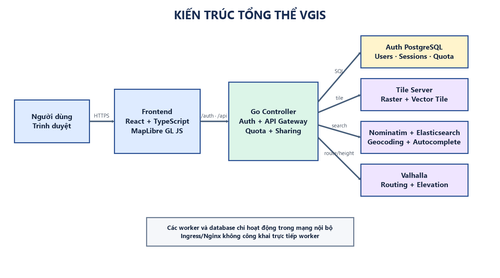
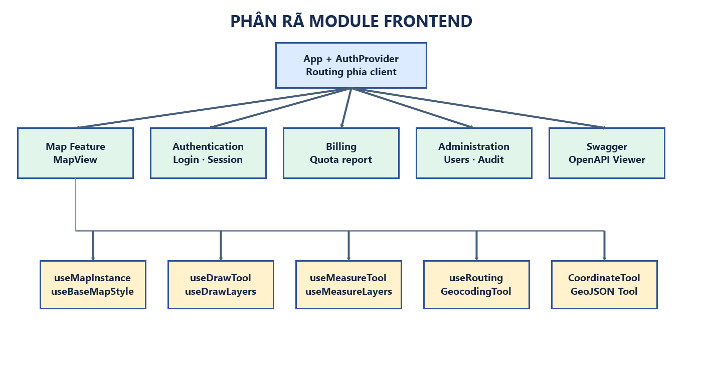
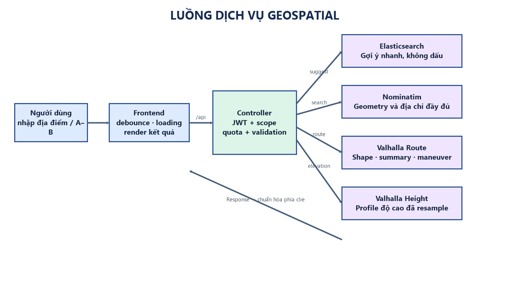
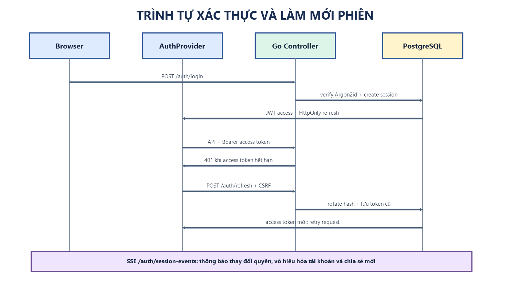
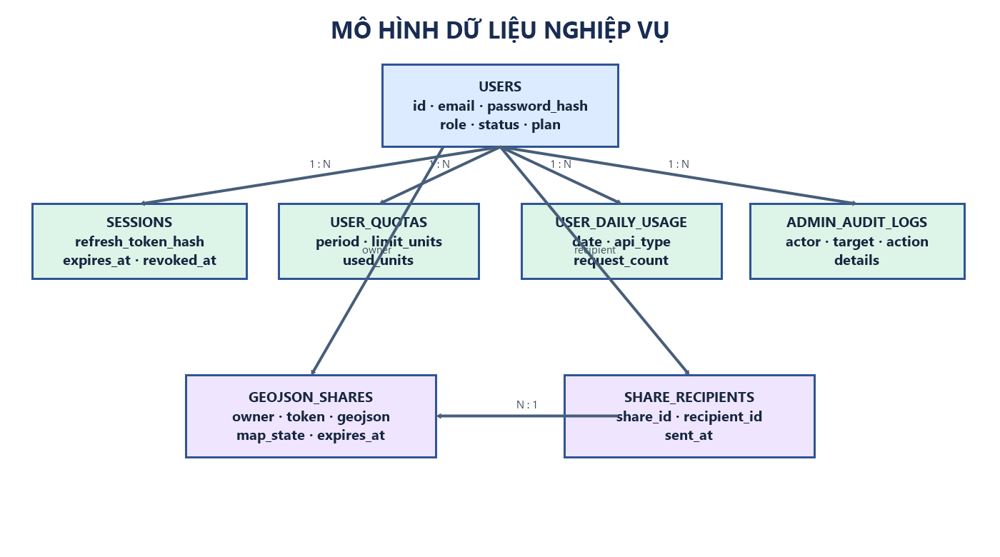
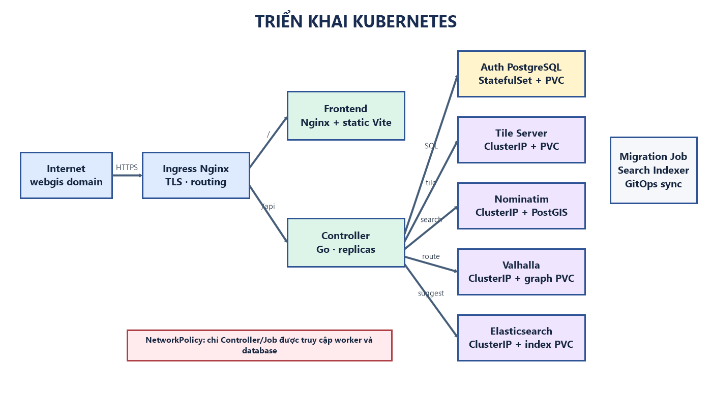

**ĐẠI HỌC QUỐC GIA HÀ NỘI**

**TRƯỜNG ĐẠI HỌC CÔNG NGHỆ**

---

# BÁO CÁO THỰC TẬP

**NGÀNH: CÔNG NGHỆ THÔNG TIN**

## ĐỀ TÀI

### XÂY DỰNG NỀN TẢNG WEBGIS FULL-STACK

### HỖ TRỢ QUẢN LÝ, PHÂN TÍCH VÀ CHIA SẺ DỮ LIỆU KHÔNG GIAN

| Thông tin             | Nội dung                                                 |
| --------------------- | -------------------------------------------------------- |
| Đơn vị thực tập       | Tổng Công ty Công nghiệp Công nghệ cao Viettel           |
| Bộ phận               | Phòng Phát triển sản phẩm – Trung tâm Chỉ huy điều khiển |
| Cán bộ hướng dẫn      | ........................................                 |
| Giảng viên đánh giá   | ........................................                 |
| Sinh viên             | Nguyễn Văn Lập                                           |
| Mã học viên/sinh viên | 496181                                                   |
| Lớp                   | ........................................                 |

**Hà Nội, tháng 9 năm 2026**

---

# MỤC LỤC

- [Lời cảm ơn](#lời-cảm-ơn)
- [Chương 1. Giới thiệu chung](#chương-1-giới-thiệu-chung)
  - [1.1. Giới thiệu đơn vị thực tập](#11-giới-thiệu-đơn-vị-thực-tập)
  - [1.2. Công việc được giao](#12-công-việc-được-giao)
  - [1.3. Lý do lựa chọn đề tài](#13-lý-do-lựa-chọn-đề-tài)
  - [1.4. Mục tiêu và phạm vi](#14-mục-tiêu-và-phạm-vi)
- [Chương 2. Bài toán và yêu cầu hệ thống](#chương-2-bài-toán-và-yêu-cầu-hệ-thống)
- [Chương 3. Cơ sở lý thuyết và giải pháp](#chương-3-cơ-sở-lý-thuyết-và-giải-pháp)
- [Chương 4. Phân tích và thiết kế hệ thống](#chương-4-phân-tích-và-thiết-kế-hệ-thống)
- [Chương 5. Cài đặt và hiện thực](#chương-5-cài-đặt-và-hiện-thực)
- [Chương 6. Triển khai, kiểm thử và kết quả](#chương-6-triển-khai-kiểm-thử-và-kết-quả)
- [Chương 7. Kết quả, kỹ năng và hướng phát triển](#chương-7-kết-quả-kỹ-năng-và-hướng-phát-triển)
- [Tài liệu tham khảo](#tài-liệu-tham-khảo)
- [Phụ lục nhận xét](#phụ-lục-nhận-xét)

---

# LỜI CẢM ƠN

Trong quá trình tập nghề và thực hiện đề tài, tôi đã nhận được sự hướng dẫn, hỗ trợ và tạo điều kiện từ các anh chị tại Tổng Công ty Công nghiệp Công nghệ cao Viettel, đặc biệt là Phòng Phát triển sản phẩm thuộc Trung tâm Chỉ huy điều khiển. Môi trường làm việc thực tế đã giúp tôi có cơ hội vận dụng kiến thức về phát triển phần mềm, hệ thống thông tin địa lý và triển khai ứng dụng vào một sản phẩm có phạm vi đầy đủ từ giao diện đến hạ tầng.

Tôi xin chân thành cảm ơn cán bộ hướng dẫn tại đơn vị đã định hướng nội dung, góp ý về kiến trúc, quy trình triển khai và cách tiếp cận bài toán WebGIS. Tôi cũng xin cảm ơn các thầy cô Trường Đại học Công nghệ, Đại học Quốc gia Hà Nội đã cung cấp nền tảng kiến thức và phương pháp làm việc cần thiết để tôi hoàn thành báo cáo này.

Do thời gian và kinh nghiệm thực tế còn hạn chế, báo cáo khó tránh khỏi thiếu sót. Tôi mong nhận được ý kiến đóng góp từ cán bộ hướng dẫn và giảng viên đánh giá để tiếp tục hoàn thiện sản phẩm.

<!-- PAGEBREAK -->

# CHƯƠNG 1. GIỚI THIỆU CHUNG

## 1.1. Giới thiệu đơn vị thực tập

Tổng Công ty Công nghiệp Công nghệ cao Viettel là đơn vị hoạt động trong lĩnh vực nghiên cứu, phát triển và sản xuất các sản phẩm công nghệ cao. Trong quá trình tập nghề, tôi làm việc tại Phòng Phát triển sản phẩm thuộc Trung tâm Chỉ huy điều khiển. Công việc của đơn vị đòi hỏi khả năng tổ chức phần mềm theo kiến trúc rõ ràng, xử lý dữ liệu có cấu trúc, bảo đảm an toàn thông tin và triển khai ổn định trên hạ tầng thực tế.

Đặc thù của các hệ thống chỉ huy, điều khiển và hỗ trợ ra quyết định thường gắn với dữ liệu vị trí. Bản đồ không chỉ là thành phần hiển thị mà còn là môi trường để người dùng tìm kiếm, đo đạc, đánh dấu, phân tích và chia sẻ thông tin không gian. Vì vậy, việc tìm hiểu và xây dựng một nền tảng WebGIS hoàn chỉnh có ý nghĩa thực tế đối với định hướng công việc tại đơn vị.

## 1.2. Công việc được giao

Nhiệm vụ được chia thành bốn giai đoạn liên tục trên cùng một codebase. Giai đoạn đầu xây dựng ứng dụng bản đồ và các công cụ tương tác cơ bản. Giai đoạn hai bổ sung quản lý GeoJSON và chuyển đổi hệ tọa độ. Giai đoạn ba phát triển backend và tích hợp các dịch vụ geospatial. Giai đoạn cuối hoàn thiện kiến trúc, xác thực, triển khai và tài liệu vận hành.

Sản phẩm cuối cùng mang tên VGIS, là một nền tảng WebGIS full-stack sử dụng React, TypeScript và MapLibre GL JS ở frontend; Go ở backend; PostgreSQL/PostGIS cho dữ liệu hệ thống; Nominatim, Elasticsearch, Valhalla và Tile Server cho các nghiệp vụ bản đồ. Ngoài phạm vi cốt lõi, hệ thống còn có chia sẻ GeoJSON, quản lý quota, dashboard quản trị, audit log, thông báo thời gian thực và các thiết lập hỗ trợ tiếp cận.

## 1.3. Lý do lựa chọn đề tài

Các ứng dụng bản đồ đơn giản thường gọi trực tiếp dịch vụ bên thứ ba từ trình duyệt. Cách làm này phù hợp với thử nghiệm nhỏ nhưng phát sinh nhiều hạn chế khi đưa vào vận hành: endpoint nội bộ bị lộ, khó kiểm soát quota, response phụ thuộc nhà cung cấp, thiếu xác thực và không có cơ chế quản trị người dùng. Một hệ thống WebGIS thực tế cần giải quyết đồng thời bài toán trải nghiệm bản đồ, tính đúng đắn của dữ liệu không gian, bảo mật API và khả năng triển khai.

Đề tài được lựa chọn nhằm xây dựng một sản phẩm xuyên suốt thay vì các bài thử rời rạc. Tất cả chức năng vẽ, đo, GeoJSON, CRS, tìm kiếm, định tuyến và quản trị được tích hợp trên cùng kiến trúc. Cách tiếp cận này giúp đánh giá được quan hệ giữa frontend, backend, cơ sở dữ liệu và hạ tầng geospatial.

## 1.4. Mục tiêu và phạm vi

Mục tiêu thứ nhất là xây dựng giao diện bản đồ có khả năng tải basemap và overlay từ Tile Server, hỗ trợ tìm kiếm, chọn vị trí, vẽ và đo đạc. Mục tiêu thứ hai là quản lý dữ liệu GeoJSON mà không làm mất geometry hoặc properties, đồng thời chuyển đổi được giữa nhiều CRS. Mục tiêu thứ ba là xây dựng Go Controller làm lớp xác thực và gateway cho Nominatim, Valhalla, Tile Server và Elasticsearch. Mục tiêu cuối cùng là đưa ra phương án triển khai có thể vận hành bằng Docker và Kubernetes, kèm tài liệu và kiểm thử.

Phạm vi đề tài tập trung vào nền tảng WebGIS và luồng dữ liệu không gian. Hệ thống không phải cổng thanh toán; phần Billing chỉ biểu diễn gói dịch vụ, hạn mức và số request API đã sử dụng. Dữ liệu tile, graph định tuyến và cơ sở dữ liệu Nominatim được xem là dữ liệu hạ tầng đã được chuẩn bị trước khi worker khởi động.

<!-- PAGEBREAK -->

# CHƯƠNG 2. BÀI TOÁN VÀ YÊU CẦU HỆ THỐNG

## 2.1. Phát biểu bài toán

Người dùng cần một không gian làm việc bản đồ thống nhất để lựa chọn lớp nền, tìm kiếm địa điểm, xác định tuyến đường, đo khoảng cách hoặc diện tích và tạo dữ liệu không gian của riêng mình. Dữ liệu đã tạo phải có thể xuất ra GeoJSON, nhập trở lại mà không mất thuộc tính, hiển thị theo hệ tọa độ phù hợp và chia sẻ cho người khác.

Ở phía hệ thống, các dịch vụ Nominatim, Valhalla và Tile Server không nên được công khai trực tiếp. Mọi request quan trọng phải đi qua Controller để xác thực, kiểm tra scope, áp dụng quota và giới hạn kích thước dữ liệu. Quản trị viên cần theo dõi người dùng, trạng thái tài khoản, mức sử dụng và lịch sử thao tác. Hệ thống cũng cần sẵn sàng cho triển khai nhiều thành phần trong Kubernetes.

## 2.2. Tác nhân sử dụng

- Người dùng chưa đăng nhập có thể đăng ký, đăng nhập, đọc tài liệu API và mở snapshot bằng liên kết công khai còn hiệu lực.
- Người dùng đã đăng nhập có thể dùng bản đồ, tìm kiếm, định tuyến, vẽ, đo, import/export, chia sẻ GeoJSON, xem quota và cập nhật thông tin liên hệ.
- Người nhận chia sẻ có thể xem danh sách bản đồ được gửi trực tiếp cho mình và nhận thông báo thời gian thực.
- Quản trị viên có thể xem dashboard, quản lý tài khoản, cấp lại mật khẩu tạm, thay đổi vai trò hoặc trạng thái, cấu hình quota và đọc audit log.
- Người vận hành chịu trách nhiệm chuẩn bị database, secret, dữ liệu geospatial, triển khai workload và theo dõi health check/log.

## 2.3. Yêu cầu chức năng

| Nhóm        | Yêu cầu chính                                                                                               |
| ----------- | ----------------------------------------------------------------------------------------------------------- |
| Bản đồ      | Tải catalog, chọn basemap, bật nhiều overlay raster/vector, hiển thị marker và tọa độ con trỏ.              |
| Tìm kiếm    | Autocomplete, geocoding chính xác, hiển thị geometry và zoom tới kết quả.                                   |
| Định tuyến  | Chọn A–B, chọn phương tiện, hiển thị tuyến, khoảng cách, thời gian, chỉ dẫn và profile độ cao.              |
| Vẽ và đo    | Vẽ Point/MultiPoint/LineString/Polygon, sửa đỉnh, thuộc tính, ẩn/hiện, undo/redo, đo khoảng cách/diện tích. |
| GeoJSON/CRS | Import, validate, chỉnh sửa, export FeatureCollection và chuyển đổi giữa các CRS được hỗ trợ.               |
| Chia sẻ     | Tạo snapshot chỉ xem, liên kết công khai, gửi theo người nhận, thông báo, danh sách nhận và thu hồi.        |
| Tài khoản   | Đăng ký, đăng nhập, refresh phiên, hồ sơ, avatar, đổi mật khẩu và đăng xuất.                                |
| Quản trị    | Dashboard, CRUD tài khoản, role/status, quota, reset mật khẩu tạm và audit log.                             |

## 2.4. Yêu cầu phi chức năng

Hệ thống phải bảo vệ mật khẩu bằng hàm băm có chi phí cao, không lưu token trong localStorage và phải phát hiện refresh token bị tái sử dụng. Các API geospatial cần giới hạn request, response và số điểm đầu vào. Các worker nội bộ phải được che sau Controller và NetworkPolicy.

Giao diện phải hoạt động trên màn hình desktop và thiết bị có chiều rộng nhỏ, hỗ trợ tiếng Việt/tiếng Anh, light/dark mode, tương phản cao, chữ lớn, giảm chuyển động và điều hướng bằng bàn phím. Các trạng thái loading, lỗi và không có kết quả phải được thể hiện rõ.

Về triển khai, frontend và backend phải build được thành image độc lập. Cấu hình endpoint, secret và khóa ký phải tách khỏi source code. CI cần kiểm tra test, lint, build và render manifest trước khi phát hành image. Các database và worker phải có persistent storage phù hợp.

## 2.5. Tiêu chí nghiệm thu

Đề tài được coi là hoàn thành khi có thể demo xuyên suốt từ đăng nhập đến thao tác bản đồ, import/export GeoJSON, đổi CRS, tìm kiếm, định tuyến và quản trị. Kết quả export phải giữ đúng geometry và properties. Request từ trình duyệt phải đi qua đường dẫn cùng origin; người dùng không thể tự giả mạo identity header để truy cập worker. Hệ thống phải vượt qua kiểm tra backend, lint và production build.

<!-- PAGEBREAK -->

# CHƯƠNG 3. CƠ SỞ LÝ THUYẾT VÀ GIẢI PHÁP

## 3.1. Kiến trúc WebGIS

WebGIS kết hợp một map engine phía trình duyệt với các nguồn dữ liệu và dịch vụ xử lý phía server. Map engine chịu trách nhiệm render tile, layer và geometry tương tác. Backend cung cấp API ổn định cho ứng dụng, trong khi các dịch vụ chuyên dụng thực hiện geocoding, routing hoặc sinh tile. Việc phân tách này giúp mỗi thành phần có trách nhiệm rõ ràng và có thể mở rộng độc lập.

VGIS chọn MapLibre GL JS vì hỗ trợ WebGL, raster tile, vector tile và style động. MapLibre được bọc trong React hook để vòng đời map không phụ thuộc trực tiếp vào vòng render component. Các source/layer của công cụ tìm kiếm, định tuyến, đo đạc và bản vẽ được tạo lại sau sự kiện đổi style để tránh mất trạng thái hiển thị.

## 3.2. GeoJSON và mô hình dữ liệu hình học

GeoJSON biểu diễn đối tượng không gian bằng Feature, Geometry và Properties. Một FeatureCollection có thể chứa nhiều loại geometry. VGIS sử dụng FeatureCollection làm định dạng trao đổi chính vì dễ kiểm tra, lưu dưới JSONB và tương thích với các công cụ GIS phổ biến.

Khi import, ứng dụng kiểm tra type, cấu trúc coordinate và từng geometry con. Các loại được hỗ trợ gồm Point, MultiPoint, LineString, MultiLineString, Polygon, MultiPolygon và GeometryCollection. ID nội bộ được chuẩn hóa để thao tác chọn/sửa ổn định; properties của người dùng được giữ lại. Độ dài và diện tích là thuộc tính dẫn xuất, được tính lại khi geometry thay đổi.

## 3.3. Hệ tọa độ và phép chiếu

Tọa độ địa lý WGS 84 sử dụng kinh độ và vĩ độ, phù hợp trao đổi dữ liệu toàn cầu nhưng không thuận tiện cho mọi phép đo phẳng. Web Mercator là phép chiếu phổ biến cho bản đồ web. UTM và VN-2000 phù hợp hơn với một số nghiệp vụ tại Việt Nam. Việc chuyển đổi sai CRS có thể làm geometry xuất hiện ở vị trí sai hoặc tạo sai số lớn.

Ứng dụng chọn EPSG:4326 làm hệ nội bộ cho MapLibre và dùng proj4 để chuyển đổi khi hiển thị hoặc import/export. Tám CRS được khai báo, gồm EPSG:4326, EPSG:3857, EPSG:32648, EPSG:32649, EPSG:4756, EPSG:3405, EPSG:3406 và EPSG:9209. Trường crs của FeatureCollection được đọc và chuẩn hóa trước khi transform.

## 3.4. Đo đạc và kiểm tra hình học

Khoảng cách được tính theo bề mặt Trái Đất bằng Turf thay vì lấy trực tiếp khoảng cách Euclid giữa kinh độ và vĩ độ. Diện tích polygon cũng được tính từ geometry địa lý. Kết quả được tự động định dạng theo m, km, m², ha hoặc km² tùy độ lớn.

Đối với polygon, hệ thống kiểm tra các cặp cạnh không kề nhau để phát hiện tự cắt. Việc này ngăn người dùng hoàn thành một vùng không hợp lệ và cải thiện chất lượng GeoJSON. Undo/redo được triển khai bằng hai stack snapshot, giúp khôi phục cả geometry và properties nhất quán.

## 3.5. Geocoding, tìm kiếm và định tuyến

Nominatim cung cấp kết quả geocoding dựa trên dữ liệu OpenStreetMap. Để autocomplete nhanh và hỗ trợ tìm không dấu, một index Elasticsearch được xây dựng từ database Nominatim. Kết quả gợi ý chỉ chứa thông tin nhẹ; khi người dùng chọn, frontend truy vấn lại Nominatim để lấy geometry có thẩm quyền.

Valhalla nhận danh sách vị trí và costing rồi trả về trip, summary, maneuver và shape mã hóa. Frontend giải mã polyline6 thành LineString, hiển thị tuyến và danh sách chỉ dẫn. Height API của Valhalla được gọi với số điểm và khoảng resample đã giới hạn để tạo profile độ cao mà không gửi payload quá lớn.

## 3.6. Xác thực và quản lý phiên

Mật khẩu được băm bằng Argon2id. Access token là JWT ký Ed25519, có issuer, audience, key ID, scope, role, session ID và thời hạn ngắn. Refresh token là chuỗi ngẫu nhiên đặt trong cookie HttpOnly; database chỉ lưu HMAC hash với pepper của server.

Mỗi lần refresh, token cũ được đưa vào bảng lịch sử và token mới được phát hành. Nếu token cũ xuất hiện lần nữa, hệ thống coi đó là replay và thu hồi phiên. Thao tác dựa trên cookie sử dụng double-submit CSRF token. Event thu hồi được ghi bền vững để các Controller pod đồng bộ sau khi restart.

<!-- PAGEBREAK -->

# CHƯƠNG 4. PHÂN TÍCH VÀ THIẾT KẾ HỆ THỐNG

## 4.1. Kiến trúc tổng thể

Kiến trúc sử dụng Controller làm ranh giới tin cậy giữa trình duyệt và các dịch vụ nội bộ. Frontend chỉ gọi các đường dẫn /auth và /api cùng origin. Controller xác thực JWT, áp dụng quota, kiểm tra dữ liệu đầu vào và chuyển tiếp request tới worker phù hợp. Cách tổ chức này tránh lộ DNS nội bộ, thống nhất xử lý lỗi và cho phép triển khai NetworkPolicy.

## 4.2. Kiến trúc frontend

Frontend được chia theo feature và hook. MapView đóng vai trò điều phối, trong khi logic bản đồ được tách thành useMapInstance, useBaseMapStyle, useDrawTool, useMeasureTool và useRouting. Các tool thuần xử lý GeoJSON, CRS, geocoding và routing không phụ thuộc vào component giao diện. AuthProvider quản lý access token trong bộ nhớ và khởi tạo luồng sự kiện phiên.

## 4.3. Luồng dịch vụ geospatial

Autocomplete và geocoding được tách thành hai bước. Elasticsearch tối ưu cho phản hồi nhanh; Nominatim cung cấp geometry đầy đủ. Route và elevation đi qua cùng gateway nhưng được giới hạn payload riêng. Tile được proxy mà không tính quota để trình duyệt và CDN có thể tận dụng cache header.

## 4.4. Luồng xác thực và sự kiện phiên

Sau đăng nhập, access token chỉ tồn tại trong memory của tab. Refresh cookie không thể đọc bằng JavaScript. Khi access token hết hạn, client gửi refresh request kèm CSRF header, nhận token mới rồi thực hiện lại request ban đầu. Server-Sent Events sử dụng refresh cookie để đẩy sự kiện thay đổi quyền hoặc nhận chia sẻ mà không đưa token vào URL.

## 4.5. Mô hình dữ liệu

Database xác thực được tách khỏi database Nominatim. Bảng users liên kết với sessions, quota, thống kê theo ngày, snapshot chia sẻ và audit log. Snapshot lưu FeatureCollection và trạng thái lớp tại thời điểm tạo; danh sách người nhận được quản lý bằng bảng liên kết nhiều-nhiều. Việc xóa snapshot sẽ đồng thời xóa quyền của người nhận.

## 4.6. Kiến trúc triển khai

Kustomize base gồm namespace, frontend, Controller, migration Job, ingress và NetworkPolicy. Auth PostgreSQL được quản lý như StatefulSet riêng. Tile Server, Valhalla, Nominatim và Elasticsearch là các worker ClusterIP; dữ liệu lớn nằm trên PVC và không được đưa vào image ứng dụng.

<!-- PAGEBREAK -->

# CHƯƠNG 5. CÀI ĐẶT VÀ HIỆN THỰC

## 5.1. Bản đồ nền và lớp dữ liệu

Frontend đọc catalog Tile Server khi người dùng mở bảng chọn lớp. Dữ liệu catalog được chuẩn hóa thành id, label, tile path, max zoom, tile size, loại raster/vector và vai trò basemap/overlay. Nếu Tile Server chỉ trả trang HTML, ứng dụng có cơ chế đọc danh sách dataset rồi truy vấn TileJSON tương ứng.

Một basemap được chọn tại một thời điểm, trong khi nhiều overlay có thể bật đồng thời. Với vector tile, style gồm các lớp landcover, landuse, water, building, boundary, transportation, place và POI. Với raster tile, opacity được cấu hình để có thể chồng lên bản đồ nền. Font glyph cũng được tải qua Controller.

## 5.2. Công cụ vẽ và chỉnh sửa

DrawTool quản lý mode select, point, multipoint, line, polygon và edit. Khi người dùng click, tọa độ được thêm vào draft; khi hoàn thành, geometry được chuyển thành Feature có ID duy nhất. Trong chế độ edit, mỗi vertex được render thành layer tương tác và mang đường dẫn tới geometry con, nhờ đó có thể chỉnh cả MultiGeometry và GeometryCollection đã import.

Mọi thay đổi quan trọng đều tạo snapshot cho undo. Khi undo, trạng thái hiện tại được đẩy sang redo stack và snapshot trước được phục hồi. Các feature ẩn vẫn tồn tại trong FeatureCollection nhưng bị lọc khỏi source hiển thị. Người dùng có thể tải riêng một feature hoặc export toàn bộ collection.

## 5.3. Công cụ đo

MeasureTool có hai mode distance và area. Ở mode distance, tổng khoảng cách là tổng các đoạn liên tiếp. Ở mode area, polygon xem trước được cập nhật trong lúc di chuyển và chỉ hoàn thành khi geometry hợp lệ. Kết quả được đặt gần geometry và tự đổi đơn vị theo độ lớn.

Công cụ hỗ trợ Ctrl hoặc Command + Z để undo và Ctrl hoặc Command + Shift + Z để redo. Listener bàn phím và sự kiện map được đăng ký trong effect và gỡ bỏ khi tool đóng, tránh rò rỉ hoặc xử lý trùng lặp sau nhiều lần bật tắt.

## 5.4. Import, export và CRS

Khi người dùng nhập file, nội dung được parse thành JSON rồi kiểm tra FeatureCollection. Geometry không hợp lệ bị từ chối trước khi cập nhật map. Nếu dữ liệu có trường crs được hỗ trợ, coordinate được transform về EPSG:4326 để render; đồng thời giao diện chuyển sang CRS tương ứng để người dùng tiếp tục làm việc.

Khi export, geometry nội bộ được transform từ EPSG:4326 sang CRS đang chọn. Properties, ID và cấu trúc geometry được giữ nguyên. Người dùng cũng có thể mở trình soạn GeoJSON, định dạng nội dung, khôi phục bản nháp hoặc áp dụng dữ liệu mới.

## 5.5. Tìm kiếm, định tuyến và elevation

SearchBar gửi query autocomplete sau một khoảng debounce. Khi người dùng chọn gợi ý, ứng dụng resolve qua Nominatim, hiển thị geometry và fit bounds. Nếu kết quả là điểm, một marker được đặt tại center; nếu là vùng, polygon thực tế được render thay vì chỉ dùng centroid.

RoutingPanel cho phép tìm hoặc click để chọn điểm A/B, sau đó chọn ô tô, xe máy, xe đạp, đi bộ, xe buýt, xe tải hoặc taxi. Route result được chuyển thành GeoJSON LineString. Summary và maneuver được trình bày cùng tuyến. Sau khi route thành công, một request elevation riêng được gửi; lỗi elevation không làm mất route đã tính.

## 5.6. Chia sẻ GeoJSON

Khi tạo chia sẻ, frontend gửi FeatureCollection gốc cùng id basemap và overlay đang bật. Backend giới hạn body 2 MiB, tối đa 5.000 feature, 32 overlay và 50 snapshot còn hiệu lực trên mỗi tài khoản. Token công khai có 32 byte ngẫu nhiên và snapshot hết hạn sau 30 ngày.

Người tạo có thể gửi snapshot tới tối đa 50 tài khoản hoạt động. Giao dịch database đồng thời tạo quan hệ người nhận và event ShareReceived. Controller pod nhận event, phát qua SSE và giao diện tạo thông báo có liên kết tới bản đồ. Trang chia sẻ là chỉ xem, có thể tự fit geometry và tải GeoJSON nhưng không sửa snapshot gốc.

## 5.7. Tài khoản, quota và quản trị

Luồng đăng ký tạo user, quota tháng mặc định và dữ liệu phiên. Login bị giới hạn theo IP và identity, đồng thời giới hạn số phép băm mật khẩu chạy song song để tránh cạn tài nguyên. Session có thời gian sống tuyệt đối và thời gian không hoạt động; refresh chỉ thành công khi cả hai điều kiện còn hiệu lực.

Quota được cập nhật atomically bằng một câu lệnh CTE: chỉ request không vượt hạn mức mới tăng used_units và tạo thống kê ngày. Billing page tổng hợp dữ liệu 1, 7 hoặc 30 ngày theo nhóm route/search. Quản trị viên có thể đổi plan, limit, role và status. Thay đổi quyền làm tăng auth version, thu hồi session cũ và yêu cầu trình duyệt đăng nhập lại.

## 5.8. API và tài liệu

Controller cung cấp OpenAPI 3.0 tại /api/openapi.json. Frontend có trang /swagger đọc chính schema của phiên bản đang chạy, nên tài liệu không phụ thuộc một file tĩnh riêng. Các endpoint được nhóm theo Authentication, Map, Sharing, Billing và Administration.

Mỗi response của Controller có X-Request-Id và X-Content-Type-Options. CORS chỉ cho phép origin đã cấu hình. Proxy tile chỉ chấp nhận đường dẫn an toàn, không cho phép path traversal và chỉ chuyển tiếp một tập header cần thiết.

<!-- PAGEBREAK -->

# CHƯƠNG 6. TRIỂN KHAI, KIỂM THỬ VÀ KẾT QUẢ

## 6.1. Môi trường phát triển

Môi trường local yêu cầu Node.js 24, Go 1.25 và PostgreSQL/PostGIS. Vite chạy tại cổng 5173, Controller chạy tại cổng 3001. Các worker mặc định lần lượt sử dụng cổng 8080 cho Tile Server, 8002 cho Valhalla, 8083 cho Nominatim và 9200 cho Elasticsearch. Vite proxy /auth và /api sang Controller để giữ cùng cấu trúc URL với production.

Backend đọc cấu hình từ be/.env và environment. Development có thể sử dụng khóa Ed25519 tạm thời; production bắt buộc cung cấp private/public key ổn định và refresh-token pepper từ secret manager. Migration được chạy trước khi khởi động Controller.

## 6.2. Docker, Kubernetes và CI/CD

Backend sử dụng multi-stage build với golang:1.25 và distroless nonroot. Frontend build bằng Node.js rồi phục vụ qua Nginx. Nginx proxy toàn bộ /auth và /api đến Controller trong cluster. Cả hai image không chứa secret.

GitHub Actions chạy Go test, ESLint, production build và kubectl kustomize. Khi commit được đưa vào nhánh main, workflow chỉ build image có source thay đổi, push lên GHCR với tag sha của commit và cập nhật manifest GitOps. Cách dùng tag bất biến giúp truy vết chính xác phiên bản đang triển khai.

## 6.3. Kết quả kiểm thử

| Hạng mục          | Kết quả                                                                                                    |
| ----------------- | ---------------------------------------------------------------------------------------------------------- |
| Go unit test      | Đạt; kiểm tra Argon2id, JWT EdDSA, password policy, suggestion, tile proxy, billing và trạng thái chia sẻ. |
| ESLint            | Đạt, không có lỗi lint.                                                                                    |
| Production build  | Đạt cho cả Go backend và React frontend.                                                                   |
| GeoJSON           | Import/export các geometry được hỗ trợ, giữ properties và CRS.                                             |
| Security path     | Tile proxy từ chối path traversal; API quản trị yêu cầu xác thực.                                          |
| Kubernetes render | Kustomize base được kiểm tra trong CI.                                                                     |

Build frontend hiện có cảnh báo một chunk lớn hơn 500 KiB trước gzip. Đây không phải lỗi blocking nhưng là cơ sở để tiếp tục tách bundle MapLibre và các lớp style bằng dynamic import.

## 6.4. Kịch bản demo

1. Đăng ký và đăng nhập, thay đổi ngôn ngữ và chế độ hiển thị.
2. Chọn basemap, bật overlay và tìm kiếm địa điểm bằng autocomplete.
3. Chọn điểm A/B, đổi phương tiện và xem route, maneuver, summary, elevation.
4. Vẽ Point, MultiPoint, LineString và Polygon; chỉnh đỉnh, properties, undo/redo.
5. Đo khoảng cách/diện tích, đổi CRS, export rồi import lại GeoJSON.
6. Tạo snapshot, mở liên kết công khai, gửi cho tài khoản khác và thu hồi.
7. Xem quota 1/7/30 ngày; đăng nhập admin để kiểm tra dashboard, người dùng và audit log.
8. Mở Swagger để đối chiếu contract API và kiểm tra health endpoint.

## 6.5. Hạn chế hiện tại

Backend đang proxy tương đối sát response của Nominatim và Valhalla; chưa có provider interface và DTO chuẩn hóa hoàn toàn độc lập nhà cung cấp. Elevation phụ thuộc bộ dữ liệu height thực tế của Valhalla. Chưa có distributed cache, metrics, tracing hoặc dashboard giám sát. GeoJSON chia sẻ được lưu JSONB thay vì kiểu geometry PostGIS nên chưa khai thác spatial index cho truy vấn nghiệp vụ.

Test hiện tập trung ở backend; frontend chưa có bộ unit test và end-to-end test tự động đầy đủ. Công cụ vẽ chưa có snap geometry, công cụ đo chưa lưu nhiều phép đo độc lập. Các hạn chế này không cản trở luồng demo chính nhưng là hướng nâng cấp cần thiết nếu mở rộng thành sản phẩm nhiều người dùng.

<!-- PAGEBREAK -->

# CHƯƠNG 7. KẾT QUẢ, KỸ NĂNG VÀ HƯỚNG PHÁT TRIỂN

## 7.1. Kết quả đạt được

Đề tài đã tạo ra một ứng dụng WebGIS full-stack chạy được, tích hợp các chức năng của bốn giai đoạn trên cùng codebase. Sản phẩm không dừng ở giao diện bản đồ mà có backend xác thực, gateway nội bộ, database, quota, chia sẻ và triển khai Kubernetes. Các luồng chính đều có trạng thái lỗi/loading và tài liệu vận hành.

So với mục tiêu ban đầu, hệ thống bổ sung nhiều chức năng production-like như refresh token rotation, durable revocation event, Server-Sent Events, role admin, audit log, NetworkPolicy, OpenAPI và CI/CD. Việc self-host Nominatim, Valhalla và Tile Server giúp hệ thống chủ động dữ liệu và giảm phụ thuộc API công cộng.

## 7.2. Kỹ năng và kiến thức thu nhận

Thông qua đề tài, tôi hiểu rõ hơn vòng đời của MapLibre, cách tổ chức source/layer và xử lý event trong React. Tôi thực hành mô hình hóa GeoJSON, kiểm tra geometry, chuyển đổi CRS và các phép đo địa lý. Tôi cũng học được cách tích hợp Nominatim, Elasticsearch và Valhalla thành một luồng thống nhất.

Ở backend, tôi có kinh nghiệm với Go net/http, pgx, transaction, JWT Ed25519, Argon2id, cookie, CSRF, rate limit và quota nguyên tử. Ở mức hệ thống, tôi thực hành Docker multi-stage, Nginx reverse proxy, Kubernetes workload/PVC/NetworkPolicy, Kustomize, Argo CD và CI/CD bằng GitHub Actions.

Một bài học quan trọng là chức năng chạy đúng chưa đủ để hình thành sản phẩm. Cần thiết kế ranh giới tin cậy, quản lý secret, giới hạn tài nguyên, xác định trách nhiệm từng service và chuẩn bị đường nâng cấp dữ liệu. Tài liệu kiến trúc và kịch bản demo cũng là một phần của chất lượng kỹ thuật.

## 7.3. Hướng phát triển

- Xây dựng provider interface và response model chung cho geocoding, routing và elevation; bổ sung fallback provider.
- Lưu layer nghiệp vụ bằng geometry PostGIS, tạo spatial index và API truy vấn theo bbox/intersection.
- Bổ sung snap vertex/edge, topology validation và nhiều phép đo độc lập.
- Thêm frontend unit test, GeoJSON/CRS round-trip test và end-to-end test bằng trình duyệt.
- Đưa Redis vào cache suggestion/route phù hợp và dùng CDN/cache cho tile.
- Tích hợp Prometheus, Grafana, tracing và cảnh báo theo SLI/SLO.
- Tối ưu bundle bằng code splitting, lazy loading MapLibre và phân tách style vector.
- Hoàn thiện backup/restore, key rotation, autoscaling và kiểm thử tải trước khi triển khai quy mô lớn.

<!-- PAGEBREAK -->

# TÀI LIỆU THAM KHẢO

1. MapLibre GL JS Documentation, https://maplibre.org/maplibre-gl-js/docs/.
2. RFC 7946 – The GeoJSON Format, Internet Engineering Task Force.
3. EPSG Geodetic Parameter Dataset, https://epsg.org/.
4. proj4js Documentation, https://proj4js.org/.
5. Turf.js Documentation, https://turfjs.org/.
6. Nominatim Manual, https://nominatim.org/release-docs/latest/.
7. Valhalla Documentation, https://valhalla.github.io/valhalla/.
8. PostgreSQL và PostGIS Documentation, https://www.postgresql.org/docs/ và https://postgis.net/documentation/.
9. OWASP Session Management Cheat Sheet và CSRF Prevention Cheat Sheet.
10. Kubernetes Documentation, https://kubernetes.io/docs/.
11. Tài liệu mã nguồn và README của dự án VGIS.

---

# PHỤ LỤC NHẬN XÉT

## A. Nhận xét của đơn vị thực tập

**Đơn vị:** Tổng Công ty Công nghiệp Công nghệ cao Viettel

**Ý kiến đánh giá:**

.............................................................................................................................

.............................................................................................................................

.............................................................................................................................

.............................................................................................................................

.............................................................................................................................

Hà Nội, ngày ...... tháng ...... năm 20......

**NGƯỜI HƯỚNG DẪN**

_(Ký, ghi rõ họ tên và đóng dấu công ty)_

## B. Nhận xét của giảng viên đánh giá

**Ý kiến đánh giá:**

.............................................................................................................................

.............................................................................................................................

.............................................................................................................................

.............................................................................................................................

.............................................................................................................................

**Điểm số:** .................... **Điểm chữ:** ....................

Hà Nội, ngày ...... tháng ...... năm 20......

**GIẢNG VIÊN ĐÁNH GIÁ**

_(Ký và ghi rõ họ tên)_

